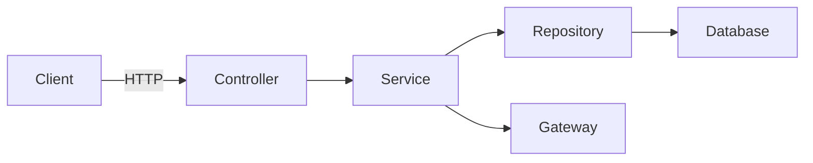

JANAWAT E-Commerce System
===
### Architecture
JANAWAT E-Commerce System architecture

1. Search product by name
- 1.1 ป้อน Adidas NMD
- 1.2 แสดงจำนวน 350 ค้นพบสิค้า สำหรับ Adidas NMD
- 1.3 แสดงรายละเอียดสินค้า 5 item
2. Choose a product
- 2.1 เลือก item สินค้า
- 3.แสดงรายละเอียดสินค้า
- 3.1 แสดงชื่อ
- 3.2 ขนาด ... สามารถเลือกได้
-  3.3 ราคา
4. Add product to basket
- 4.1 กดปุ่ม ใส่ตะกร้า
5. Show data in basket
- 5.1 แสดงจำนวน สินค้าในตะกร้า
- 5.2 แสดงรูปสินค้า
- 5.3 แสดง รายละเอียดสินค้า
- 5.4 แสดงราคา
6. Checkout
- 6.1 กด ชำระสินค้า
- 6.2 ตัดเงิน
- 6.3 ส่งเมล์
- 7 Shipping
- 7.1 แสดงรายละเอียดที่จัดส่ง พร้อมแก้ไขได้
- 7.2 แสดงรายละเอียดสินค้าที่จัดส่ง
- 7.3 แสดงมูลค่าสินค้า
8. Payment
- 8.1 เลือกช่อฝทางการชำระ
- 8.2 ผ่านบัตรเครดิต หรือเดบิต
- 8.3 เก็บเงินปลายทาง
- 8.4 ชำระผ่าน เคาน์เตอร์
- 8.5 payPal/Amex
- 8.6 ผ่อนชำระ
- 8.7 LINE Pay
- 8.8 หักบัญชีธนาคาร/ช่องทาง ATM
- 9 Comfirm to order
- 9.1 กดปุ่มยืนยันการสั่งซื้อ
- 10 Summary
- 10.1 พิมพ์ใชแจ้งการชำระ(paySlip)
 

**Test cases**  

|   | Story | Insert | Total | Selected | Got item? | Change |
|---|-------|------------------|------------|-----------|----------|------------|
| 1 |User insert 10 baht and 5 baht coins and select Pepsi Max|10, 5|15|Pepsi Max|true|-|
| 2 |User insert 10 baht, 5 baht, 2 baht and 1 baht coins and select Pepsi Max|10, 5, 2, 1|18|Pepsi Max|true|2, 1|
| 3 |User insert 10 baht and 2 baht coins and select Pepsi Max but can't select it because user don't have enough money|10, 2|12|Pepsi Max|false|-|
| 4 |User insert 10 baht and 2 baht coins and select Coke Vanilla (S) but can't select it because this product isn't available|10, 2|12|Coke Vanilla (S)|false|-|
| 6 |User insert 10 baht (2 coins) and 2 baht (1 coin) but user would like to refund|10, 10, 2|22|-|false|10, 10, 2|

Product listing
---

| API | Endpoint | Method |
|-----|----------|--------|
|Product listing|https://www.mocky.io/v2/5c77c5b330000051009d64c9|GET|

Acceptance agreement
---

1. Fork this github project.
2. Open `issue` feature in your repository (Options > Features > Checked on Issues) [#Reference](https://softwareengineering.stackexchange.com/questions/179468/forking-a-repo-on-github-but-allowing-new-issues-on-the-fork)
3. Put your code in `exercise` folder.
4. Publish your project on hosting, cloud or something that we can play it :) (DigitalOcean, Firebase Hosting, Heroku)

Any question?
---
Open your issue from this link below

https://github.com/igeargeek/fullstackdev-internship-challenge/issues
