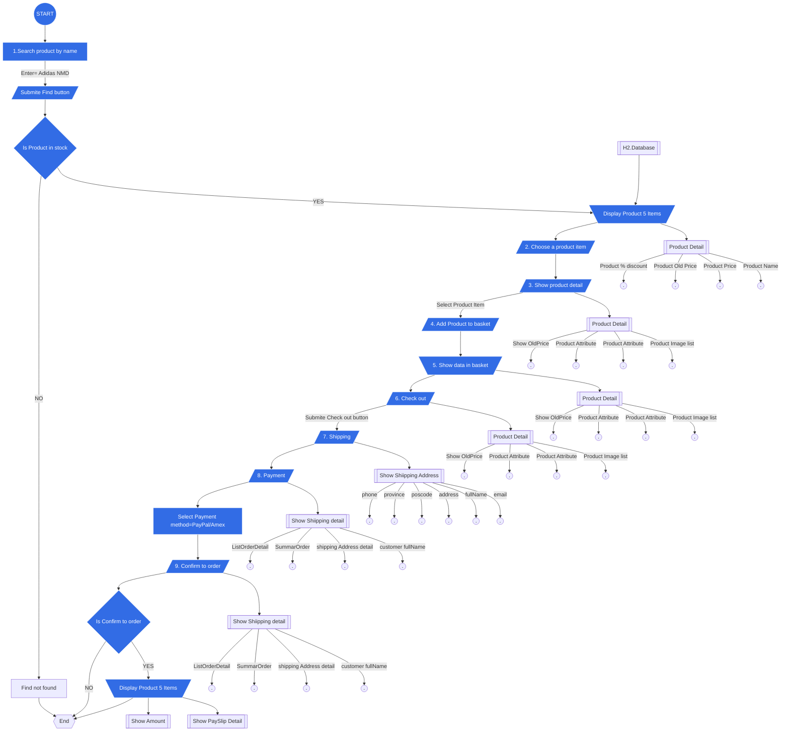

JANAWAT E-Commerce System
---
Process
---


Architecture
---
JANAWAT E-Commerce System architecture
---


[//]: # (Entity Relationship Diagram)

[//]: # (---)

[//]: # (```mermaid)

[//]: # (   erDiagram)

[//]: # (   USER ||--o{ CUSTOMER : owns)

[//]: # (   USER {        )

[//]: # (        int id       )

[//]: # (        string userName)

[//]: # (        string password)

[//]: # (        string email)

[//]: # (   }   )

[//]: # (   SHIPPING_ADDRESS ||--o{ CUSTOMER : places)

[//]: # (   SHIPPING_ADDRESS {  )

[//]: # (        int id      )

[//]: # (        string houseNo       )

[//]: # (        string district)

[//]: # (        string province)

[//]: # (        string postcode)

[//]: # (   })

[//]: # (   CUSTOMER_ADDRESS_MAPPING ||--o{ CUSTOMER : places)

[//]: # (   CUSTOMER_ADDRESS_MAPPING ||--o{ SHIPPING_ADDRESS : places)

[//]: # (   CUSTOMER_ADDRESS_MAPPING {  )

[//]: # (        int id      )

[//]: # (        int customerId       )

[//]: # (        int shippingAddressId)

[//]: # (        string addressType)

[//]: # (   })

[//]: # (   )
[//]: # (   SHIPPING_ADDRESS ||--|{ ORDER_DETAIL : contains)

[//]: # (   CUSTOMER ||--o{ ORDER : places)

[//]: # (   CUSTOMER {)

[//]: # (        int id )

[//]: # (        int userId)

[//]: # (        string firstName)

[//]: # (        string lastName)

[//]: # (        string phone)

[//]: # (   })

[//]: # (   ORDER ||--|{ ORDER_DETAIL : contains)

[//]: # (   ORDER {)

[//]: # (        int id)

[//]: # (        int customerId)

[//]: # (        int shippingAddressId)

[//]: # (        datetime createdDate)

[//]: # (        string typeShipping)

[//]: # (        string paymentMethod        )

[//]: # (   })

[//]: # (   ORDER_DETAIL {)

[//]: # (        int orderId)

[//]: # (        int productAttributeId)

[//]: # (        int qty)

[//]: # (        double price)

[//]: # (        double sumprice)

[//]: # (   })

[//]: # (   SHOPPINCARD ||--o{ CUSTOMER : places)

[//]: # (   SHOPPINCARD {)

[//]: # (        int id)

[//]: # (        int customerId)

[//]: # (        int shippingId)

[//]: # (        datetimt createdDate)

[//]: # (        datetimt updatedDate       )

[//]: # (        )
[//]: # (   })

[//]: # (   SHOPPINCARD_DETAIL ||--o{ SHOPPINCARD : places)

[//]: # (   SHOPPINCARD_DETAIL {)

[//]: # (        int shoppingCardId)

[//]: # (        int productAttributeId)

[//]: # (        int qty)

[//]: # (        double price         )

[//]: # (   })

[//]: # (   PRODUCT_CATEGORY ||--|{ PRODUCT : contains   )

[//]: # (   PRODUCT_CATEGORY {)

[//]: # (        int id)

[//]: # (        string categoryName)

[//]: # (   })

[//]: # (   )
[//]: # (   PRODUCT ||--|{ ORDER_DETAIL : contains  )

[//]: # (   PRODUCT {)

[//]: # (        int id)

[//]: # (        string productName)

[//]: # (        double price)

[//]: # (        double oldprice)

[//]: # (             )
[//]: # (   })

[//]: # (   PRODUCT_ATTRIBUTE ||--|{ PRODUCT : contains)

[//]: # (   PRODUCT_ATTRIBUTE ||--|{ SHOPPINCARD_DETAIL : contains)

[//]: # (   PRODUCT_ATTRIBUTE {)

[//]: # (        int id)

[//]: # (        int productId)

[//]: # (        string color)

[//]: # (        string size)

[//]: # (        double price)

[//]: # (        double oldprice)

[//]: # (        int qtyInStock)

[//]: # (        int qtyTotall)

[//]: # (        int qtyMinimum  )

[//]: # (   })

[//]: # (   )
[//]: # (   PRODUCT_IMAGE_LIST ||--|{ PRODUCT : contains)

[//]: # (   PRODUCT_IMAGE_LIST {)

[//]: # (        int id)

[//]: # (        int productId)

[//]: # (        string imageName)

[//]: # (        string urlImage)

[//]: # (   })

[//]: # (```)

**API Endpoint**
---
| user-controller | Endpoint                                             | Method |
|-----------------|------------------------------------------------------|--------|
| /login          | http://localhost:8080/login | POST   |
---
| product-controller          | Endpoint                                             | Method |
|-----------------------------|------------------------------------------------------|--------|
| /GetProductByName/{productName}            | http://localhost:8080/GetProductByName/{productName} | GET    |
| /GetProductByName/{productName}/{page}              | http://localhost:8080/GetProductByName/{productName}/{page}  | GET    |
| /GetProductById/{productId}               | http://localhost:8080/GetProductById/{productId}  | GET    |
| /GetProductAll/{page}   | http://localhost:8080/GetProductAll/{page}     | GET   |
--- 
| cart-controller | Endpoint                                           | Method |
|---------------|----------------------------------------------------|--------|
| /cart/items    | http://localhost:8080/cart/items  | POST    |
| /cart/paymentMethod   | http://localhost:8080/cart/paymentMethod | PUT    |
| /cart/address   | http://localhost:8080/cart/address | PUT    |
| /cart    | http://localhost:8080/cart  | GET    |
---
**Test Script**
---
1. Login to System 
   - 1.1. Call api *{POST}* = /login 
   - .... http://localhost:8080/login
   - .... _Body_ = {"username": "nuchit", "password": "1234"}
   - 
2. Search product by name
   - 2.1 Find Product name=ADIDAS 
     - Call api *{GET}* = /GetProductByName/{productName}
     - 
     - .... http://localhost:8080/GetProductByName/ADIDAS
     - Default display page 1, size = 5 item
   - You can chang page view 
   - ... call api /GetProductByName/{productName}/{page}
   - 
   - .... http://localhost:8080/GetProductByName/ADIDAS/2
   -    
3. Choose a product
   - 3.1 Select Product by item ...
   - 3.2 Call api *{GET}* = /GetProductById/{productId}
   - 
   - ....http://localhost:8080/GetProductById/2
   - ....view product detail Item 2
   - 
4. Show product detail
   - 4.1 view product item 2
   - 4.2 Call api *{GET}* = /GetProductById/{productId}
   - 
   - ....http://localhost:8080/GetProductById/2
   - 
5. Add product to basket
   - 5.1 Add product to Card ... order quantity = 2
   - 5.2 call api *{POST}* = /cart/items
   - ....Body= {"productId": productId, "quantity": quantity}
   - 
   - ....http://localhost:8080/cart/items
   - ....Body= {"productId": 2, "quantity": 2}
   - 
6. Show data in basket
   - 6.1 Check product in Shopping card
   - 6.2 Call api *{GET}* = /cart
   - ....Bearer Token="Token current user login"
   - 
   - ....http://localhost:8080/cart
   - ....Bearer Token="sample_token nuchit"
   - 
7. Checkout
   - ...Next step
   - 
8. Shipping
   - 8.1 Display Shipping address
   - 8.2 Update address
   - ....Call api *{PUT}* = /cart/address
   - ....Bearer Token="Token current user login"
   - ....Body={"addressId": addressId}
   - 
   - ....http://localhost:8080/cart/address
   - ....Bearer Token="sample_token nuchit"
   - ....Body={"addressId": 1}
   - 
   - 8.3 view shopping card detail
   - ....Call api *{GET}* = http://localhost:8080/cart
   - ....Bearer Token="sample_token nuchit"
   - 
9. Payment
   - Select Payment method=creditCard
   - 
10. Confirm to order
    - 10.1 Update payment method
    - call api *{PUT}* = http://localhost:8080/cart/paymentMethod
    - ....Body={"paymentMethodId": 1}
    - ....Bearer Token="sample_token nuchit"
    - 
11. Summary 
    - 11.1 Summary Order detail
    - 11.2 call api *{GET}* = http://localhost:8080/cart
    - ....Bearer Token="sample_token nuchit"
    
Any question?
---
Open your issue from this link below
https://github.com/nuchit2019/assignment-java-boot-camp/issues
