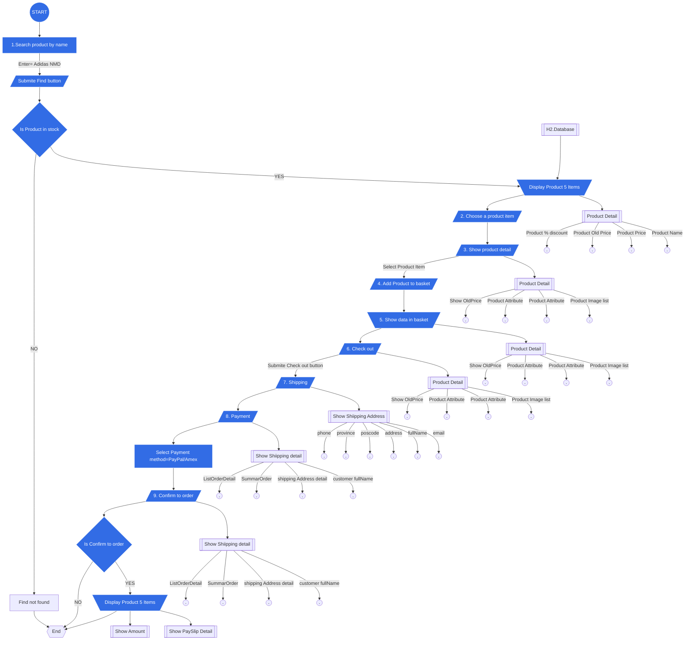
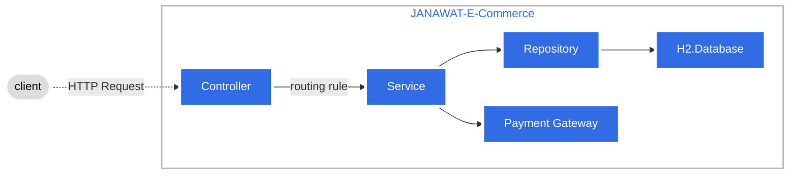

JANAWAT E-Commerce System
---
Process
---

Architecture
---
JANAWAT E-Commerce System architecture
---

---
**API Endpoint**
---
| user-controller | Endpoint                                             | Method |
|-----------------|------------------------------------------------------|--------|
| /login          | http://localhost:8080/login | POST   |
---
| product-controller          | Endpoint                                             | Method |
|-----------------------------|------------------------------------------------------|--------|
| /GetProductByName/{productName}            | http://localhost:8080/GetProductByName/{productName} | GET    |
| /GetProductByName/{productName}/{page}              | http://localhost:8080/GetProductByName/{productName}/{page}  | GET    |
| /GetProductById/{productId}               | http://localhost:8080/GetProductById/{productId}  | GET    |
| /GetProductAll/{page}   | http://localhost:8080/GetProductAll/{page}     | GET   |
--- 
| cart-controller | Endpoint                                           | Method |
|---------------|----------------------------------------------------|--------|
| /cart/items    | http://localhost:8080/cart/items  | POST    |
| /cart/paymentMethod   | http://localhost:8080/cart/paymentMethod | PUT    |
| /cart/address   | http://localhost:8080/cart/address | PUT    |
| /cart    | http://localhost:8080/cart  | GET    |
---
**Test Script**
---
1. Start...
2. Login to System 
   - 1.1. Call api post *{host}/login*
   - .... *Body= {"username": username, "password":password}*
   - 
   - .... http://localhost:8080/login
   - .... _Body_ = {"username": "nuchit", "password": "1234"}
   - 1.2 Return tokens
     
3. Search product by name
   - 3.1 Find Product name=ADIDAS 
     - Call api get *{host}/GetProductByName/{productName}*  
       
     - ....http://localhost:8080/GetProductByName/ADIDAS
     - Default display page 1, size = 5 item
   - 3.2 You can chang page view ...page default to page ??
   - ...Call api get *{host}/GetProductByName/{productName}/{page}*
   - ...to page 2
   - ... http://localhost:8080/GetProductByName/ADIDAS/2
     
   - 
   - ...to page 3
   - ... http://localhost:8080/GetProductByName/ADIDAS/3
     
   -    
4. Choose a product
   - 4.1 Select Product by item 2
   - 4.2 Next step
     
5. Show product detail
   - 5.1 View detail product item 2
   - 5.2 Call api get *{host}/GetProductById/{productId}*  
   - ....http://localhost:8080/GetProductById/2
     
   - 
6. Add product to basket
   - 6.1 Add product to Card ... order quantity = 2
   - 6.2 call api post *{host}/cart/items* 
   - ....*Bearer Token="{token}"*
   - ....*Body= {"productId":productId, "quantity":quantity}*
     
   - ....http://localhost:8080/cart/items
   - ....Bearer Token="sample_token nuchit"
   - ....Body= {"productId": 2, "quantity": 2}
   - 6.3 Reduce the InStock of products, *InStock = (InStock-quantity)*
   - ....productsId=2,
     - .... ....InStock before = 15
     - .... ....InStock after  = 13
   - ....productsId=2,InStock=(15-2) = 13
     
   - 
7. Show data in basket
   - 7.1 Check product in Shopping card
   - 7.2 Call api get = *{host}/cart*
   - ....*Bearer Token={token}*
   - 
   - ....http://localhost:8080/cart
   - ....Bearer Token="sample_token nuchit"
     
   - 
8. Checkout
   - ...Next step
   - 
9. Shipping
   - 9.1 Display Shipping address
   - 9.2 Update address
   - ....Call api put = *{host}/cart/address*
   - ....*Bearer Token={token}*
   - ....*Body={"addressId": addressId}*
   - 
   - ....http://localhost:8080/cart/address
   - ....Bearer Token="sample_token nuchit"
   - ....Body={"addressId": 1}
   - 
   - 9.3 view shopping card detail
   - ....Call api put = *{host}/cart*
   - ....*Bearer Token={token}*
   - 
   - ....Call api *{GET}* = http://localhost:8080/cart
   - ....Bearer Token="sample_token nuchit"
     
   - 
10. Payment
    - Select Payment method=creditCard
    - 
11. Confirm to order
    - 11.1 Update payment method
    - call api put *{host}//cart/paymentMethod*
    - ....*Bearer Token={token}*
    - ....*Body={"paymentMethodId": paymentMethodId}*
    - 
    - ....http://localhost:8080/cart/paymentMethod
    - ....Body={"paymentMethodId": 1}
    - ....Bearer Token="sample_token nuchit"
      
12. Summary 
    - 12.1 Summary Order detail
    - 12.2 Call api get *{host}/cart*
    - .......*Bearer Token={token}*
    - 
    - ....http://localhost:8080/cart
    - ....Bearer Token="sample_token nuchit"
      
13. The end...
    
Any question?
---
Open your issue from this link below
https://github.com/nuchit2019/assignment-java-boot-camp/issues
