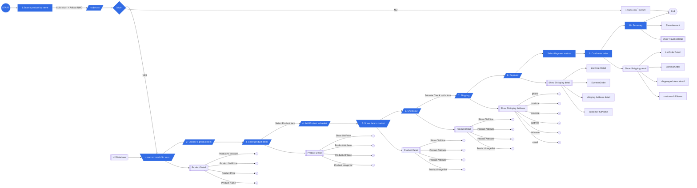

# JANAWAT E-Commerce System
### Process 

### Architecture
JANAWAT E-Commerce System architecture

#### Entity Relationship Diagram

**Test cases**

|   | Story | Insert | Total | Selected | Got item? | Change |
|---|-------|------------------|------------|-----------|----------|------------|
| 1 |User insert 10 baht and 5 baht coins and select Pepsi Max|10, 5|15|Pepsi Max|true|-|
| 2 |User insert 10 baht, 5 baht, 2 baht and 1 baht coins and select Pepsi Max|10, 5, 2, 1|18|Pepsi Max|true|2, 1|
| 3 |User insert 10 baht and 2 baht coins and select Pepsi Max but can't select it because user don't have enough money|10, 2|12|Pepsi Max|false|-|
| 4 |User insert 10 baht and 2 baht coins and select Coke Vanilla (S) but can't select it because this product isn't available|10, 2|12|Coke Vanilla (S)|false|-|
| 6 |User insert 10 baht (2 coins) and 2 baht (1 coin) but user would like to refund|10, 10, 2|22|-|false|10, 10, 2|

Product listing
---

| API | Endpoint | Method |
|-----|----------|--------|
|Product listing|https://www.mocky.io/v2/5c77c5b330000051009d64c9|GET|

Acceptance agreement
---

1. Fork this github project.
2. Open `issue` feature in your repository (Options > Features > Checked on
   Issues) [#Reference](https://softwareengineering.stackexchange.com/questions/179468/forking-a-repo-on-github-but-allowing-new-issues-on-the-fork)
3. Put your code in `exercise` folder.
4. Publish your project on hosting, cloud or something that we can play it :) (DigitalOcean, Firebase Hosting, Heroku)

Any question?
---
Open your issue from this link below

https://github.com/igeargeek/fullstackdev-internship-challenge/issues
